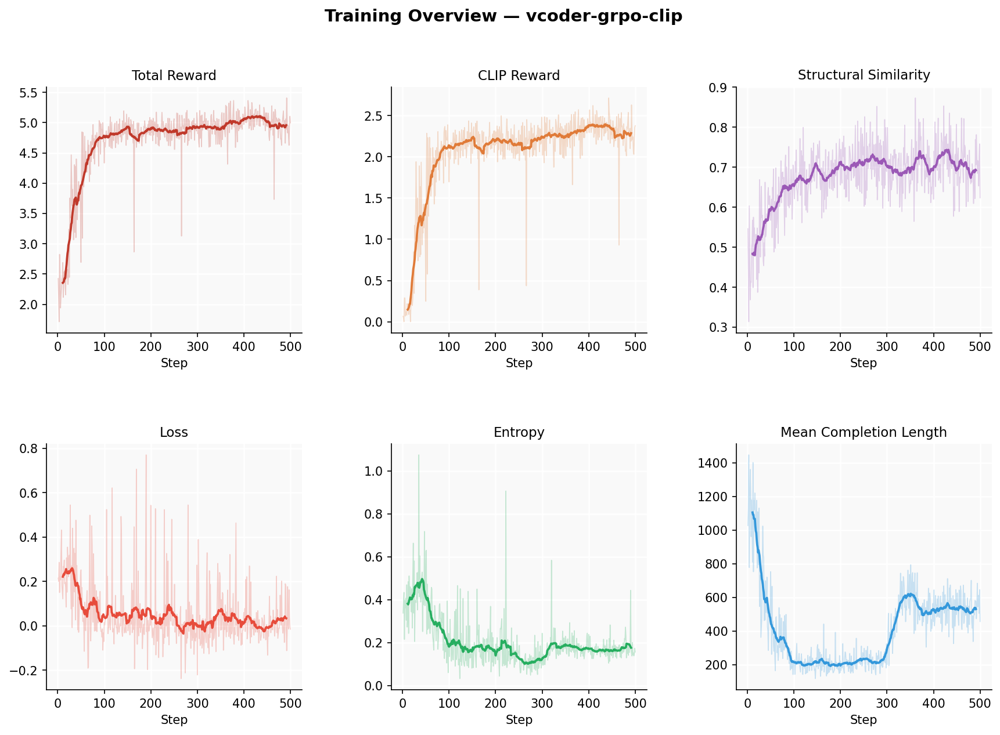
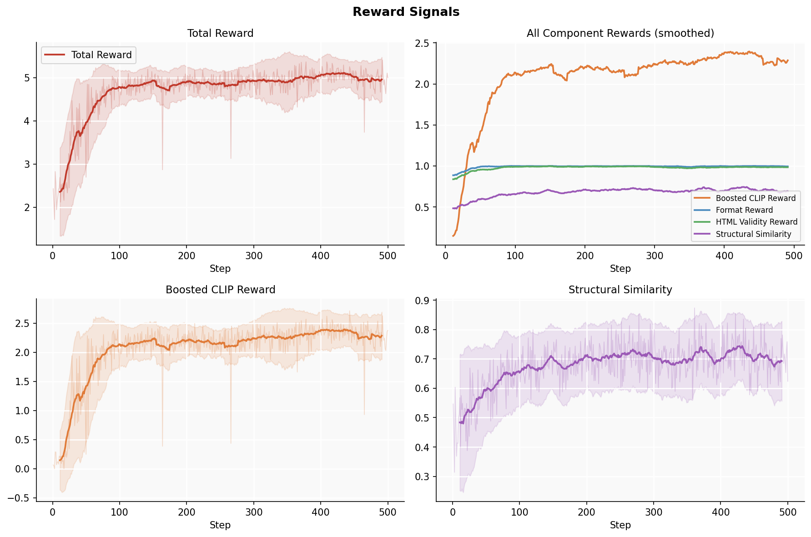
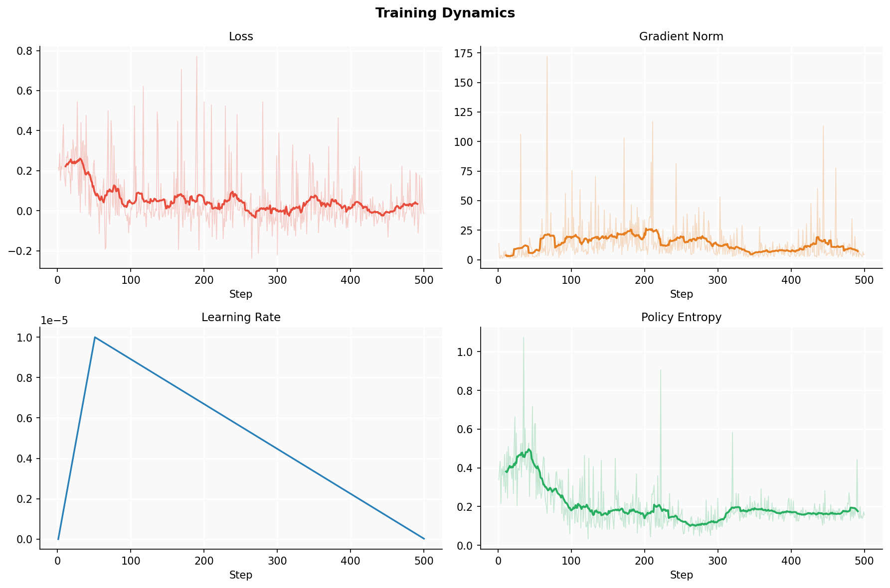
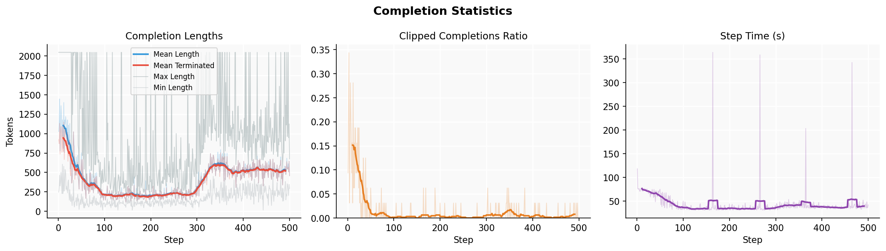
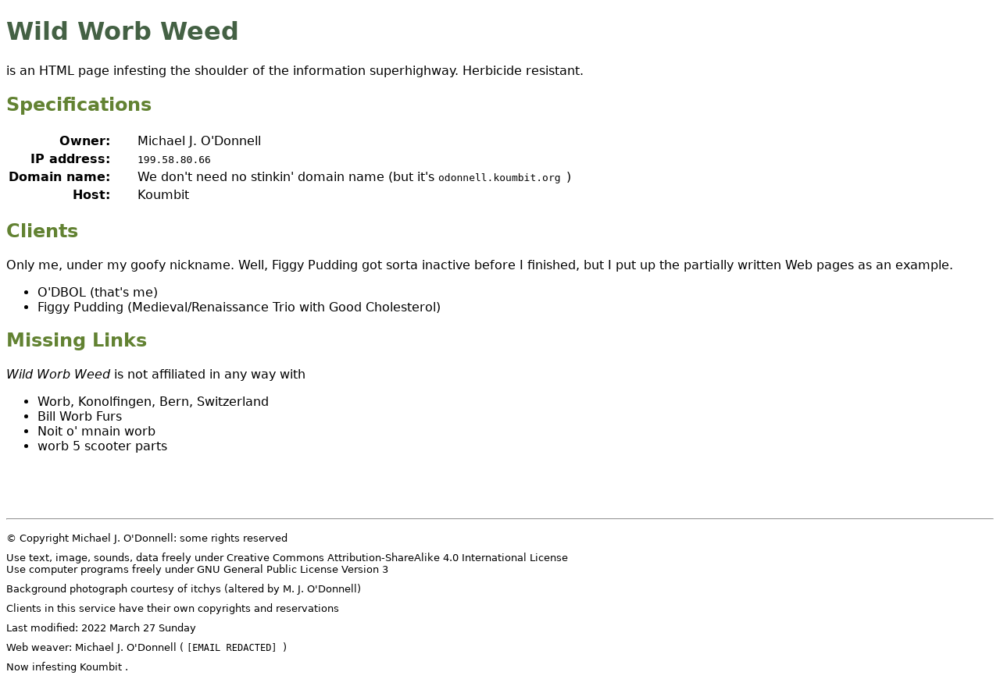
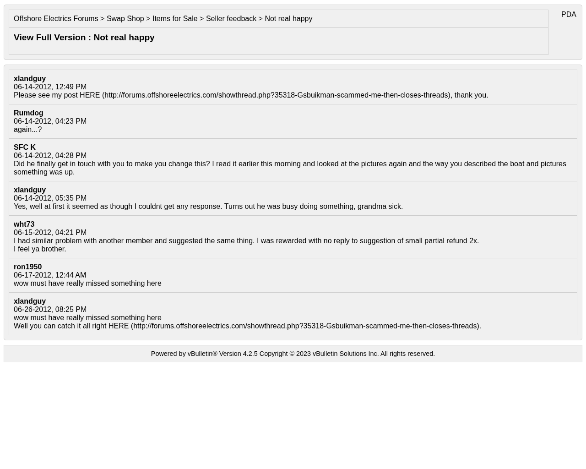
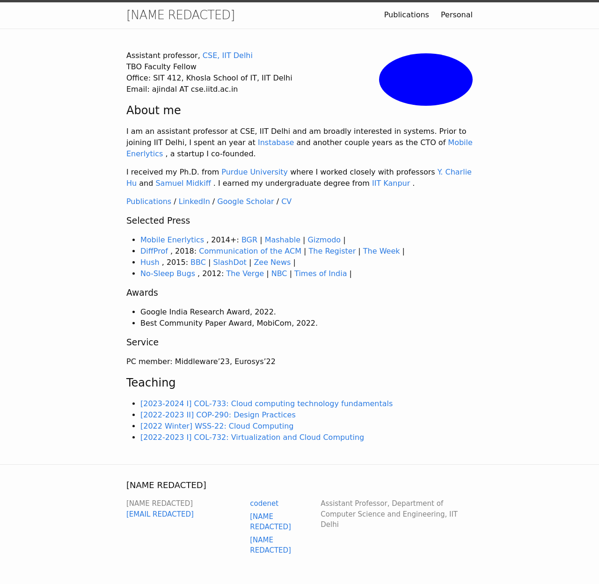
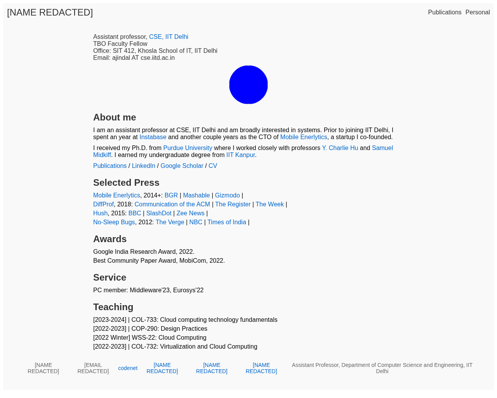

# VisionCoder — RLVR for Screenshot-to-HTML Generation

Fine-tuning a vision-language model with **Reinforcement Learning from Verifiable Rewards (RLVR)** to convert UI screenshots into clean HTML/CSS.

> **Input:** UI screenshot &nbsp;→&nbsp; **Output:** HTML + CSS that visually reproduces it

---

## Models

| Model | HuggingFace | Description |
|---|---|---|
| VisionCoder-SFT | [amaljoe88/vcoder-sft](https://huggingface.co/amaljoe88/vcoder-sft) | Qwen3-VL-2B fine-tuned with supervised learning on WebSight |
| VisionCoder-RL | [amaljoe88/vcoder-rl](https://huggingface.co/amaljoe88/vcoder-rl) | Qwen3-VL-2B fine-tuned with GRPO RL from base |
| VisionCoder-SFT+RL | [amaljoe88/vcoder-sft-rl](https://huggingface.co/amaljoe88/vcoder-sft-rl) | Qwen3-VL-2B SFT warm-start then GRPO RL (best) |

All models are based on [Qwen/Qwen3-VL-2B-Instruct](https://huggingface.co/Qwen/Qwen3-VL-2B-Instruct) and trained on [HuggingFaceM4/WebSight](https://huggingface.co/datasets/HuggingFaceM4/WebSight).

---

## Results

### WebSight Holdout Evaluation (100 samples, vLLM + async inference)

Evaluated on 100 held-out WebSight samples using async vLLM inference (64 concurrent requests). Metrics computed with Playwright rendering + CLIP similarity.

| Model | Format | Validity | Structural | CLIP | **Total** |
|---|---|---|---|---|---|
| Qwen3-VL-2B (base) | 0.7225 | 0.6220 | 0.3710 | 0.4827 | 3.164 |
| [VisionCoder-SFT](https://huggingface.co/amaljoe88/vcoder-sft) | 1.0000 | 0.9890 | 0.8154 | 0.7497 | 5.053 |
| [VisionCoder-RL](https://huggingface.co/amaljoe88/vcoder-rl) | 1.0000 | 0.9840 | 0.7092 | 0.7564 | 4.963 |
| **[VisionCoder-SFT+RL](https://huggingface.co/amaljoe88/vcoder-sft-rl)** | **1.0000** | **0.9880** | **0.8176** | **0.7531** | **5.065** |

**Total** = format + validity + structural + 3 × CLIP

Key observations:
- All fine-tuned models reach near-perfect format/validity (≥0.98), up from base's 0.72/0.62
- **SFT+RL** achieves the best total score, combining SFT's strong structural learning with RL's visual fine-tuning
- **RL-only** lags SFT by ~0.11 on structural similarity — warm-starting from SFT before RL is consistently better
- CLIP visual fidelity saturates around 0.75 across all trained variants

### Design2Code Benchmark (484 held-out examples)

Evaluated on the [Design2Code](https://github.com/NoviScl/Design2Code) benchmark.

| Metric | Qwen3-VL-2B (base) | **VCoder-GRPO-CLIP** | Δ |
|---|---|---|---|
| **Overall** | 0.232 | **0.788** | +240% |
| Block-Match | 0.101 | **0.795** | +687% |
| Text Match | 0.107 | **0.884** | +722% |
| Position | 0.088 | **0.706** | +703% |
| Color | 0.091 | **0.698** | +663% |
| CLIP Similarity | 0.772 | **0.858** | +11% |

---

## Training Overview



### Training Pipeline

Three variants were trained in sequence:

1. **SFT** — 250 steps of supervised fine-tuning on WebSight (loss 0.25 → 0.091, 97% token accuracy)
2. **RL** — 1 000 steps of GRPO starting from the base model (reward 2.0 → 5.0)
3. **SFT+RL** — 1 000 steps of GRPO starting from the SFT checkpoint (reward 5.2 → 5.3, faster convergence)

Key observations from RL training:
- **Total reward** rises from ~2.4 to ~5.0 (RL from base) / starts at 5.2 and stabilises ~5.3 (SFT+RL)
- **CLIP reward** climbs from near-zero to ~2.4 after 3× boosting
- **Format + validity** rewards converge to near-perfect within ~100 steps
- **Completion length** drops sharply (~1 000 → ~460 tokens) as the model learns cleaner HTML
- **Entropy** decreases monotonically, indicating a confident but not collapsed policy

---

## Reward Design

| Reward | Weight | Signal |
|---|---|---|
| `boosted_clip_reward` | 3× | CLIP image-image similarity between rendered HTML and reference screenshot |
| `format_reward` | 1× | Presence of `<think>` + `<html>` structure |
| `html_validity_reward` | 1× | HTML parses without critical errors |
| `structural_similarity_reward` | 1× | DOM-level structural similarity to reference |

All rewards are computed without any human annotation. Rendering is done with a headless Playwright browser pool.

---

## Detailed Training Curves

### Reward Signals


### Training Dynamics


### Completion Statistics


---

## Qualitative Samples

Three examples from the Design2Code testset. Each row: reference screenshot → base model render → VCoder-GRPO-CLIP render.

### Sample 1 (testset idx 3) — CLIP: base 0.828 → ft **0.947** (+0.12)

| Reference | Base (Qwen3-VL-2B) | VCoder-GRPO-CLIP |
|:---:|:---:|:---:|
|  |  |  |

### Sample 2 (testset idx 7) — CLIP: base 0.785 → ft **0.849** (+0.06)

| Reference | Base (Qwen3-VL-2B) | VCoder-GRPO-CLIP |
|:---:|:---:|:---:|
|  |  |  |

### Sample 3 (testset idx 5) — CLIP: base 0.557 → ft **0.792** (+0.23)

| Reference | Base (Qwen3-VL-2B) | VCoder-GRPO-CLIP |
|:---:|:---:|:---:|
|  |  |  |

#### Per-sample CLIP Similarity (10 testset images)

| idx | Base | VCoder-GRPO-CLIP | Δ |
|---|---|---|---|
| 0 | 0.525 | 0.542 | +0.018 |
| 1 | 0.547 | 0.788 | +0.241 |
| 2 | 0.380 | 0.369 | −0.011 |
| **3** | **0.828** | **0.947** | **+0.120** |
| 4 | 0.725 | 0.760 | +0.035 |
| **5** | **0.557** | **0.792** | **+0.235** |
| 6 | 0.789 | 0.633 | −0.156 |
| **7** | **0.785** | **0.849** | **+0.064** |
| 8 | 0.428 | 0.499 | +0.072 |
| 9 | 0.754 | 0.752 | −0.001 |

Bold rows = shown above. Average across 10 samples: base 0.632 → ft **0.693** (+0.061).

---

## Architecture

```
vcoder/
├── pipelines/
│   ├── training.py         # GRPO RL training entry point (accelerate launch)
│   └── sft_training.py     # SFT training entry point
├── rewards/
│   ├── visual_rewards.py       # CLIP + SSIM rewards via async Playwright rendering
│   ├── structural_rewards.py   # DOM tree similarity reward
│   ├── validity_rewards.py     # HTML validity reward
│   └── format_rewards.py       # Format / thinking-tag reward
├── rendering/
│   ├── html_renderer.py        # Headless browser rendering
│   └── browser_pool.py         # Async Playwright browser pool
├── data/websight.py             # WebSight dataset loader
├── eval/
│   ├── eval_vllm.py            # vLLM async batched evaluation (64 concurrent)
│   └── eval_standalone.py      # Single-GPU sequential evaluation
└── utils/
    ├── image_utils.py          # CLIP similarity utilities
    └── html_utils.py           # HTML extraction helpers
experiments/
└── plot_run.py                  # Plot training curves from trainer_state.json
```

---

## Setup

```bash
# Install package
pip install -e . --no-deps

# Install Playwright for rendering
playwright install chromium
```

---

## Training

### SFT

```bash
CUDA_VISIBLE_DEVICES=0,1 accelerate launch \
    --config_file configs/accelerate_2gpu.yaml \
    vcoder/pipelines/sft_training.py \
    --model_id Qwen/Qwen3-VL-2B-Instruct \
    --output_dir outputs/vcoder-sft \
    --max_samples 2000
```

### GRPO RL (from base or SFT checkpoint)

```bash
# RL from base
CUDA_VISIBLE_DEVICES=0,1 accelerate launch \
    --config_file configs/accelerate_2gpu.yaml \
    vcoder/pipelines/training.py \
    --model_id Qwen/Qwen3-VL-2B-Instruct \
    --output_dir outputs/vcoder-rl

# SFT+RL (warm-start from SFT)
CUDA_VISIBLE_DEVICES=0,1 accelerate launch \
    --config_file configs/accelerate_2gpu.yaml \
    vcoder/pipelines/training.py \
    --model_id outputs/vcoder-sft/checkpoint-200 \
    --output_dir outputs/vcoder-sft-rl
```

---

## Evaluation

Start vLLM servers (one per GPU), then run async batched eval:

```bash
# Start servers
CUDA_VISIBLE_DEVICES=0 python -m vllm.entrypoints.openai.api_server \
    --model amaljoe88/vcoder-sft --served-model-name sft --port 8000 \
    --max-model-len 4096 --dtype bfloat16

CUDA_VISIBLE_DEVICES=1 python -m vllm.entrypoints.openai.api_server \
    --model amaljoe88/vcoder-sft-rl --served-model-name sft_rl --port 8001 \
    --max-model-len 4096 --dtype bfloat16

# Run evaluation (64 concurrent requests)
python vcoder/eval/eval_vllm.py \
    --servers sft:localhost:8000 sft_rl:localhost:8001 \
    --num_samples 100 \
    --concurrency 64 \
    --output_json outputs/eval_results.json
```

---

## Plot Training Curves

```bash
python3 experiments/plot_run.py                          # latest checkpoint
python3 experiments/plot_run.py --run_dir outputs/vcoder-rl --checkpoint 1000
```

Plots saved to `<run_dir>/plots/`.

---

## Setup Details

- **Base model:** [Qwen/Qwen3-VL-2B-Instruct](https://huggingface.co/Qwen/Qwen3-VL-2B-Instruct)
- **SFT training:** TRL SFTTrainer, 2× A100 80GB GPUs, ~250 steps
- **RL training:** TRL GRPOTrainer, 2× A100 80GB GPUs, 1 000 steps each (~2 hours/run)
- **Dataset:** 2 000 samples from [HuggingFaceM4/WebSight](https://huggingface.co/datasets/HuggingFaceM4/WebSight)
- **Evaluation:** 100 held-out WebSight samples + [Design2Code](https://github.com/NoviScl/Design2Code) benchmark

---

## Team

Amal Joe · Job J
